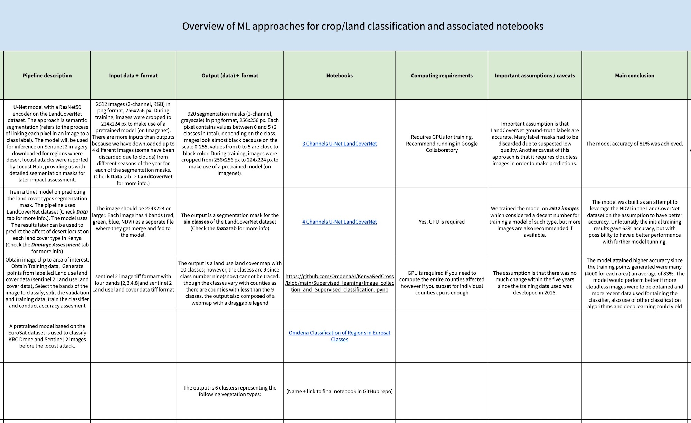

# ASSESSMENT OF DESERT LOCUST IN KENYA
The project entails use of satellite and drone imagery for a desert locust impact assessment study by deriving accurate vegetation cover types for the 16 Kenyan counties that were adversely affected by desert locusts and quantifying the impact on desert locusts via drone imagery and classification models.

A detailed overview of the datasets, algorithms, and notebooks contained in this GitHub repository can be found [here](https://docs.google.com/spreadsheets/d/1JdeHaaESbJCJbJzjwssV3kLND_JdM2dPcoRsbCwndlc)

# DESCRIPTION
### Datasets 
The datasets that were considered include satellite imagery from EuroSAT,  LandcoverNet and Sentinel - 2 imagery.

### Supervised Learning Approach
Various Supervised Learning Approaches are implemented to classify the different vegetation cover types. These approaches include: 

* Semantic Segmentation (U-Net Model)

* Classification using CNNs (ResNet 34 Encoders and ResNet 50)

### Unsupervised Learning Approach
Three clustering algorithms are implemented on the Sentinel - 2 imagery obtained to group the vegetation cover types into 6 clusters. The algorithms implemented are:

* SCAN

* VGG 16 plus K-Means Clustering

* Deep Clustering (Autoencoders plus KMeans)

### Other Approaches
The file "Other Approaches"  is the collection of various approches collaborators worked on besides the ones listed above.

These are suitable as a reference for future work.

### Damage Assessment
In order to quantify the damage caused on the different vegetation cover types, the following approaches were considered:

* Compute the total area damaged in hectares.

* Compute the total area damaged per county.

* Compute the vegetation cover damage per county.

# DATA
This project makes use of Satellite imagery from the following data sources: 

* Radiant ML Hub - Labelled LandCoverNet data on African Land-cover types. 

* The Copernicus Open Access Hub - Unlabelled Sentinel - 2 images of given counties before and After Desert Locust attack.

* Locust Hub - Coordinates of the regions and the dates of the start and the end of the attack were referenced from [Locust Hub Website](https://locust-hub-hqfao.hub.arcgis.com/).

* EuroSAT data - A novel dataset based on Sentinel-2 satellite images covering 13 spectral bands and consisting out of 10 classes with in total 27,000 labeled and geo-referenced images.

The Kenya Red Cross also provided the following data:

* Drone imagery of Tharaka Nithi County during the desert locust attack in the county.

* Geojson file with a list of all high risk counties in Kenya to ensure the data collected is accurate and as per the areas that were affected in Kenya. 

* Geojson file by KRCS with a list of vegetation cover types to assist with assessing the vegetation cover types that were more adversely affected.

* A csv file with some of the ground data with vegetation cover types, obtained from transect drive.

# CONTRIBUTING

This Project was done by collaborators from Omdena in partnership with Kenya Red Cross.

Pull requests are welcome. For major changes, please open an issue first to discuss what you would like to change.

Please make sure to update tests as appropriate.

# License
[MIT](https://choosealicense.com/licenses/mit/)
 
